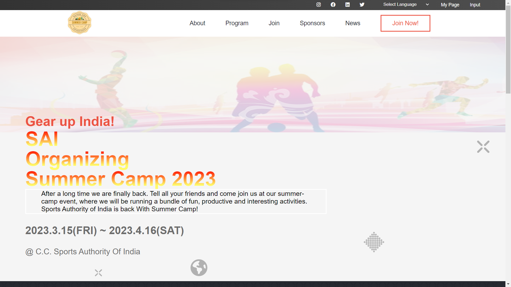
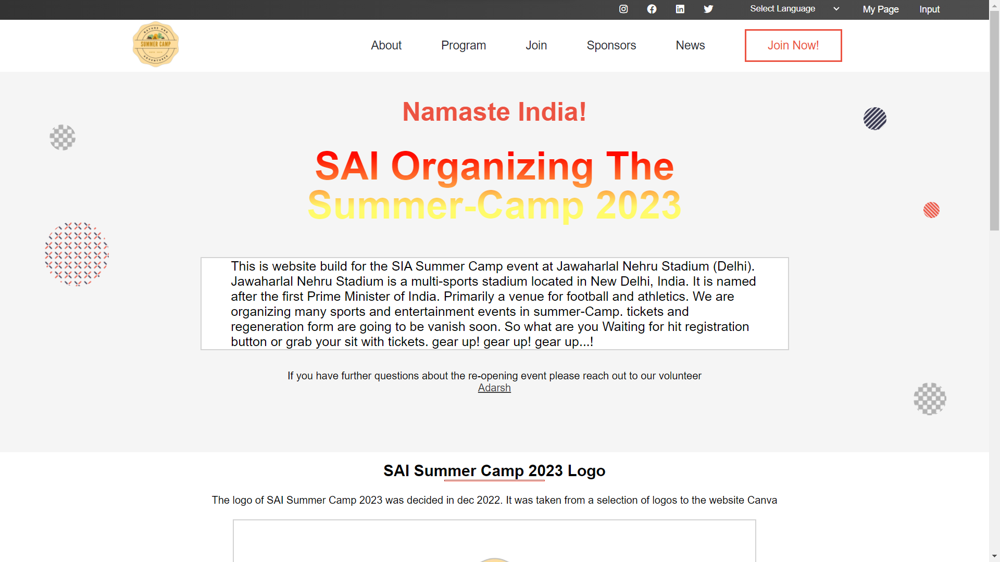
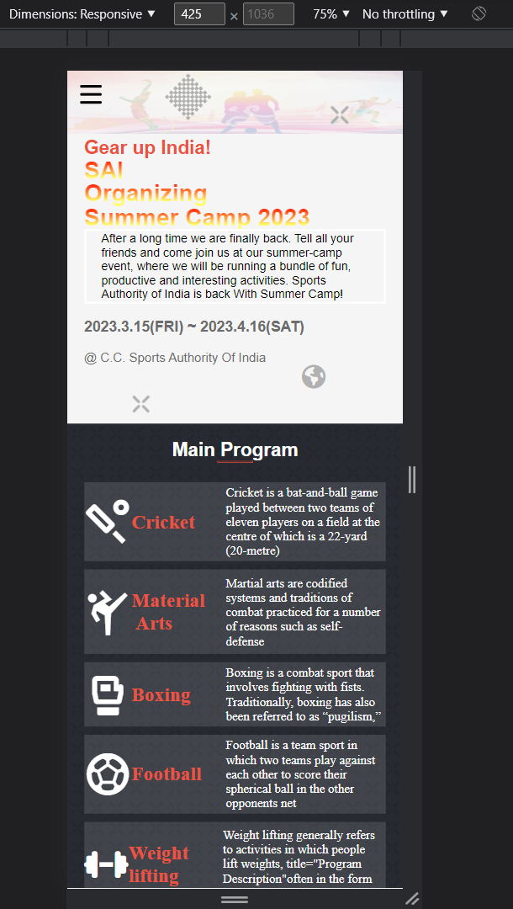
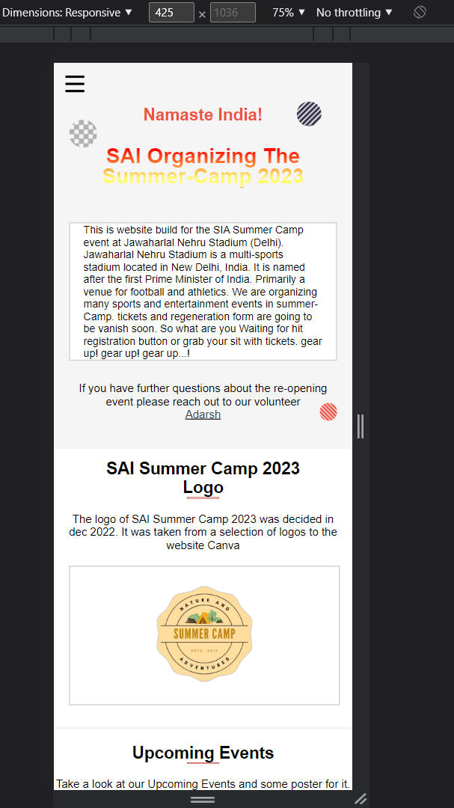

  
  
   
  <h1><b>Summer Camp Event Page</b>  </h1>
  

<h2>Main Page <b>Desktop View<b>  </h2>

  

<h2>About Page <b>Desktop View<b>  </h2>

  

  <h2>About Page <b>Mobile View<b>  </h2>
  
  <h2>About Page <b>Mobile View<b>  </h2>
  

<!-- TABLE OF CONTENTS -->

# 📗 Table of Contents

- [📖 About the Project](#about-project)
  - [🛠 Built With](#built-with)
    - [Tech Stack](#tech-stack)
    - [Key Features](#key-features)
  - [🚀 Live Demo](#live-demo)
- [💻 Getting Started](#getting-started)
  - [Setup](#setup)
  - [Prerequisites](#prerequisites)
  - [Install](#install)
  - [Usage](#usage)
  - [Run tests](#run-tests)
  - [Deployment](#triangular_flag_on_post-deployment)
- [👥 Authors](#authors)
- [🔭 Future Features](#future-features)
- [🤝 Contributing](#contributing)
- [⭐️ Show your support](#support)
- [🙏 Acknowledgements](#acknowledgements)
- [❓ FAQ ](#faq)
- [📝 License](#license)

<!-- PROJECT DESCRIPTION -->

# 📖 Summer Camp Event Page 

> This Project is about the event going to be held in the march THE Summer Camp organized by SIA

**Summer Camp Event Page** is just a introduction about the upcoming event 

## 🛠 Built With 

### Tech Stack 

> In this project I used many skills, tech and libraries

  
Documentation

  <ul>
    <li><a href="https://html.com">HTML</a></li>
  </ul>

  
Styling

  <ul>
    <li><a href="https://www.w3.org">CSS</a></li>
  </ul>

Dynamics And Logics

  <ul>
    <li><a href="https://michalsnik.github.io/aos/">JavaScript</a></li>
  </ul>

Animation

  <ul>
    <li><a href="https://michalsnik.github.io/aos/">Aos.js</a></li>
  </ul>

<!-- Features -->

### Key Features 

> Following features you should observe

- **Animation on scroll**
- **Navigation list hover**
- **Pre Navigation bar is about me**
- **Pre Navigation bar have Google Translator for our wbsite**

(<a href="#readme-top">back to top</a>)

<!-- LIVE DEMO -->

## 🚀 Live Demo 

> This link will guide you to my project

- [Live Demo Link](https://powerlevel9000.github.io/Dynamic-Event-Template/)
- [Loom Video](https://powerlevel9000.github.io/Dynamic-Event-Template/)

(<a href="#readme-top">back to top</a>)

<!-- GETTING STARTED -->

## 💻 Getting Started 

>For having local file and project you can fork this repo 

>And for making changes you you should follow prerequisites

### Prerequisites

In order to edit this project you need:

 - Any text editor such as note pad and word pad
 - A web browser

#### suggested 
 - visual studio code
 - atom 
 - visual code 

### Setup

Clone this repository to your desired folder:

 - click on index.html
 - open in the browser

### Usage

 Execute the following thing:
 
 - See project buttons
 - Navigation bar on desktop version

### Run tests

- Check whether animation is good
- check all the link on social icons are working or not 
- also click on Adarsh in about page to mail me
- also i want to add call me button give suggestion 

### Deployment

You can deploy this project using:

- for this repo and use git hub pages to deploy it 

(<a href="#readme-top">back to top</a>)

<!-- AUTHORS -->

## 👥 Authors 

👤 **Adarsh Pathak**

- GitHub: [@PowerLevel9000](https://github.com/githubhandle)
- Twitter: [@PowerLevel9002](https://twitter.com/PowerLevel9002?t=AIuSN7mTxk5a_MWpLolEjA&s=09)
- LinkedIn: [@Adarsh Pathak](https://www.linkedin.com/in/adarsh-pathak-56a831256/)

<!-- 👤 **Rubén D. Pire**

- GitHub: [@rpire](https://github.com/rpire) -->

<!-- FUTURE FEATURES -->

## 🔭 Future Features 

> Describe 1 - 3 features you will add to the project.

- [ ] **Add more Pages**
- [ ] **Dynamic everything so that it can be switchable for many websites**
- [ ] **Registration Form**

(<a href="#readme-top">back to top</a>)

<!-- CONTRIBUTING -->

## 🤝 Contributing 

Contributions, issues, and feature requests are welcome!

Feel free to check the [issues page](../../issues/).

(<a href="#readme-top">back to top</a>)

<!-- SUPPORT -->

## ⭐️ Show your support 

If you like my Project give it a Star ✨🌟 

(<a href="#readme-top">back to top</a>)

<!-- ACKNOWLEDGEMENTS -->

## 🙏 Acknowledgments 

This project design is reflection of Original design idea by [Cindy Shin in Behance](https://www.behance.net/adagio07).

(<a href="#readme-top">back to top</a>)

<!-- FAQ (optional) -->

## ❓ FAQ 

> ask questions to be here 

- **[Question_1]**

  - [Answer_1]

- **[Question_2]**

  - [Answer_2]

(<a href="#readme-top">back to top</a>)

<!-- LICENSE -->

## 📝 License 

This project is [MIT](./LICENSE) licensed.

_NOTE: we recommend using the [MIT license](https://choosealicense.com/licenses/mit/) - you can set it up quickly by [using templates available on GitHub](https://docs.github.com/en/communities/setting-up-your-project-for-healthy-contributions/adding-a-license-to-a-repository). You can also use [any other license](https://choosealicense.com/licenses/) if you wish._

(<a href="#readme-top">back to top</a>)

