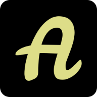
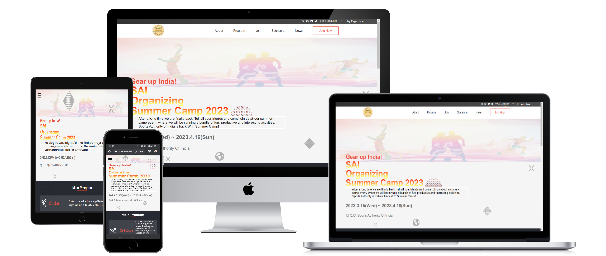

<a name="readme-top"></a>
<!-- the change -->
<div align="center">
  
  
  <br/>
  <h1><b>Summer Camp Event Page</b><br><br></h1>
  
</div>

<div align="center">
  
</div>
<!-- TABLE OF CONTENTS -->

# 📗 Table of Contents

- [📖 About the Project](#about-project)
  - [🧪 Linters And Deployment](#linters)
  - [🛠 Built With](#built-with)
    - [Tech Stack](#tech-stack)
    - [Key Features](#key-features)
  - [🚀 Live Demo](#live-demo)
- [💻 Getting Started](#getting-started)
  - [Setup](#setup)
  - [Prerequisites](#prerequisites)
  - [Install](#install)
  - [Usage](#usage)
  - [Run tests](#run-tests)
  - [Deployment](#triangular_flag_on_post-deployment)
- [👥 Authors](#authors)
- [🔭 Future Features](#future-features)
- [🤝 Contributing](#contributing)
- [⭐️ Show your support](#support)
- [🙏 Acknowledgements](#acknowledgements)
- [❓ FAQ ](#faq)
- [📝 License](#license)

<!-- PROJECT DESCRIPTION -->

# 📖 Summer Camp Event Page <a name="about-project"></a>

This Project is about the event going to be held in the march THE Summer Camp organized by SIA

**Summer Camp Event Page** is just a introduction about the upcoming event 
this template is made for organizing various events . it is fully dynamic if you want to organize another event you just need to give data and instruction 

## 🧪 Linters And Deployment <a name="linters"></a>

[](https://github.com/PowerLevel9000/Dynamic-Event-Template/actions/workflows/linters.yml)
[](https://github.com/PowerLevel9000/Dynamic-Event-Template/actions/workflows/pages/pages-build-deployment)

## 🛠 Built With <a name="built-with"></a>

### Tech Stack <a name="tech-stack"></a>

<details>
  <summary>Documentation</summary>
  <ul>
    <li><a href="https://html.com">HTML</a></li>
  </ul>
</details>

<details>
  <summary>Styling</summary>
  <ul>
    <li><a href="https://www.w3.org">CSS</a></li>
  </ul>
</details>

<details>
<summary>Dynamics And Logics</summary>
  <ul>
    <li><a href="https://michalsnik.github.io/aos/">JavaScript</a></li>
  </ul>
</details>

<details>
<summary>Animation</summary>
  <ul>
    <li><a href="https://michalsnik.github.io/aos/">Aos.js</a></li>
  </ul>
</details>

<!-- Features -->

### Key Features <a name="key-features"></a>

 Following features you should observe

- **Animation on scroll**
- **Navigation list hover**
- **Pre Navigation bar is about me**
- **Pre Navigation bar have Google Translator for our website**

<p align="right">(<a href="#readme-top">back to top</a>)</p>

<!-- LIVE DEMO -->

## 🚀 Live Demo <a name="live-demo"></a>

 This link will guide you to my project 💕💕😁 don't forget to take a look at my presentation video 😜😜

- [Live Demo Link](https://powerlevel9000.github.io/Dynamic-Event-Template/)
- [Loom Video](https://www.loom.com/share/263ca564cb634bcca4b48ad1ea9870b7)

<p align="right">(<a href="#readme-top">back to top</a>)</p>

<!-- GETTING STARTED -->

## 💻 Getting Started <a name="getting-started"></a>

For getting started yu can fork this repo or clone it in desired directory and make sure to follow [Prerequisites](#prerequisites) correctly


### Prerequisites

In order to edit this project you need:

 - Any text editor such as note pad and word pad
 - A web browser
 - Node js installed
 - An IDE

#### Suggested IDE
 - Visual studio code `I prefer this one 🙃🙃`
 - Atom 
 - Sublime 
 - IntelliJ IDEA
 - Visual code 

### Install

```
npm i 
```
### Setup

Clone this repository to your desired folder:

 - click on index.html
 - open in the browser


### Usage

 Execute the following thing:
 
 - See project buttons
 - Navigation bar on desktop version


### Run tests
> For now we don't have automated test but you can test it manually
- Check whether animation is good
- check all the link on social icons are working or not 
- also click on Adarsh in about page to mail me
- also i want to add call me button give suggestion 

### Deployment

You can deploy this project using:

- for this repo and use GitHub pages to deploy it 

<p align="right">(<a href="#readme-top">back to top</a>)</p>

<!-- AUTHORS -->

## 👥 Authors <a name="authors"></a>


👤 **Adarsh Pathak**

- GitHub: [@PowerLevel9000](https://github.com/githubhandle)
- Twitter: [@PowerLevel9002](https://twitter.com/PowerLevel9002?t=AIuSN7mTxk5a_MWpLolEjA&s=09)
- LinkedIn: [@Adarsh Pathak](https://www.linkedin.com/in/adarsh-pathak-56a831256/)


<!-- FUTURE FEATURES -->

## 🔭 Future Features <a name="future-features"></a>

- [ ] **Add more Pages**
- [ ] **Dynamic everything so that it can be switchable for many websites**
- [ ] **Registration Form**

<p align="right">(<a href="#readme-top">back to top</a>)</p>

<!-- CONTRIBUTING -->

## 🤝 Contributing <a name="contributing"></a>

Contributions, issues, and feature requests are welcome!

Feel free to check the [issues page](../../issues/).

<p align="right">(<a href="#readme-top">back to top</a>)</p>

<!-- SUPPORT -->

## ⭐️ Show your support <a name="support"></a>


If you like my Project give it a Star ✨🌟 

<p align="right">(<a href="#readme-top">back to top</a>)</p>

<!-- ACKNOWLEDGEMENTS -->

## 🙏 Acknowledgments <a name="acknowledgements"></a>

This project design is reflection of Original design idea by  ©️[Cindy Shin in Behance](https://www.behance.net/adagio07).

<p align="right">(<a href="#readme-top">back to top</a>)</p>

<!-- FAQ (optional) -->

## ❓ FAQ <a name="faq"></a>

> Ask Intreating questions to be here 

- **Question_1** When next event going to be held 

  - Answer_1 All event information will be updated on website please check it regularly so tha you won't miss it 😉


<p align="right">(<a href="#readme-top">back to top</a>)</p>

<!-- LICENSE -->

## 📝 License <a name="license"></a>

This project is [MIT](./MIT.md) licensed.

<p align="right">(<a href="#readme-top">back to top</a>)</p>
